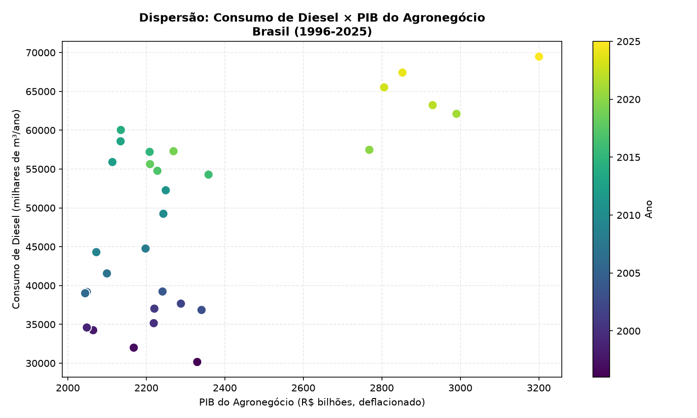
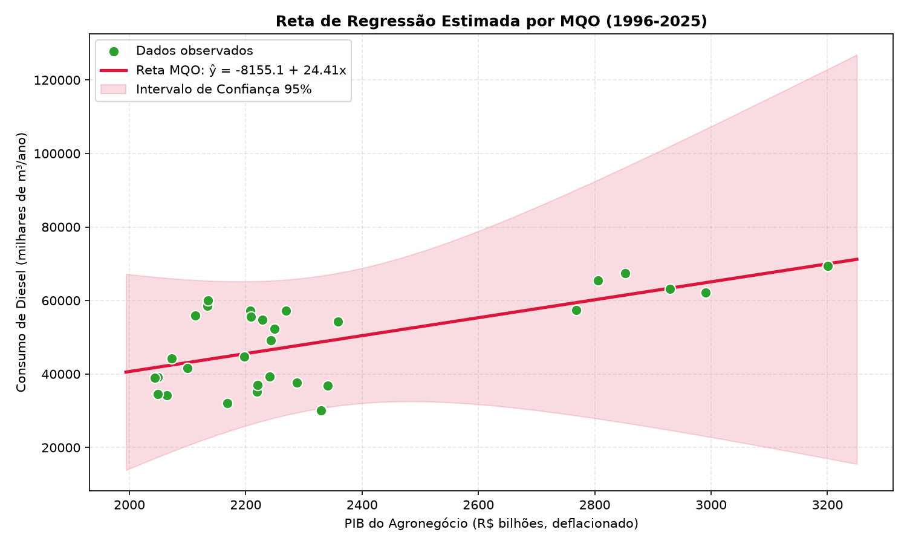
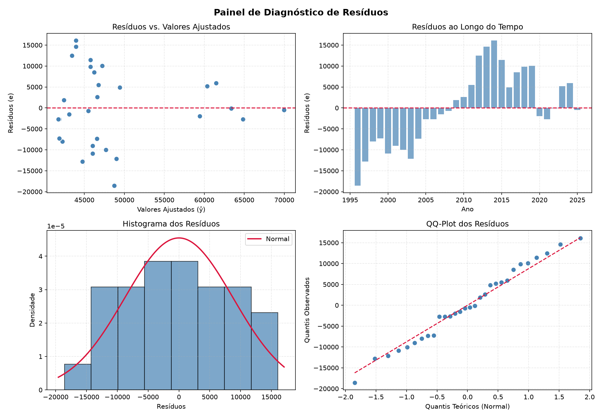
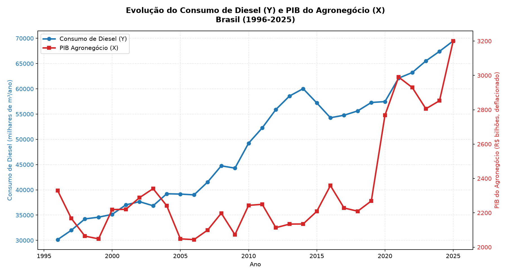

# 📊 Análise Econométrica — Consumo de Diesel × PIB do Agronegócio Brasileiro

Trabalho de econometria que investiga a relação de longo prazo entre o **consumo nacional de diesel** e o **PIB do agronegócio** (valor adicionado, metodologia CEPEA/Esalq-USP) no Brasil, para o período de **1996 a 2025**.

## 🎯 Objetivo

Quantificar, por meio de regressão linear simples (MQO), como o crescimento real do agronegócio brasileiro se relaciona com a demanda nacional por diesel (principal combustível da cadeia logística e produtiva agrícola).

## 📂 Estrutura do Projeto

```
projeto-econometria/
├── analise_econometrica.py    # Único script de código (executa a análise, plota gráficos e gera o Word)
├── dados_econometria.csv      # Base de dados consolidada e real (30 observações, 1996-2025)
├── trabalho_econometria.md    # Relatório completo
└── graficos/                  # Pasta com os gráficos atualizados gerados automaticamente
    ├── 01_dispersao_diesel_pib.png
    ├── 02_regressao_simples.png
    ├── 03_residuos_regressao_simples.png
    └── 04_serie_temporal_diesel_pib.png
```

## 📈 Modelo Estimado

### Regressão Linear Simples (MQO)
```
consumo_diesel = -8.155,09 + 24,41 × pib_agro
R² = 0,4307 (43,07%)  |  p-valor = 8,21 × 10⁻⁵
```
*   **Interpretação:** Para cada aumento de R$ 1 bilhão no PIB real do agronegócio (valores deflacionados para dez/2025), o consumo nacional de diesel aumenta em aproximadamente **24,41 mil m³ por ano**.

## 📊 Gráficos

| Dispersão | Reta de Regressão |
|:-:|:-:|
|  |  |

| Diagnóstico de Resíduos | Série Histórica |
|:-:|:-:|
|  |  |

## 🗂️ Fontes dos Dados

| Variável | Descrição | Fonte |
|---|---|---|
| PIB do Agronegócio (R$ bi, deflacionado) | PIB-renda real em moeda de dez/2025 | [CEPEA/Esalq-USP](https://www.cepea.esalq.usp.br/br/pib-do-agronegocio-brasileiro.aspx) |
| Consumo de Diesel (mil m³/ano) | Vendas totais das distribuidoras | [ANP (Dados Abertos)](https://www.gov.br/anp/) |

## 🛠️ Como Executar

### Pré-requisitos
- Python 3.8+
- Bibliotecas: `pandas`, `numpy`, `matplotlib`, `scipy`, `python-docx`

### Instalação das dependências
```bash
pip install pandas numpy matplotlib scipy python-docx
```

### Executar a análise
Rode o script unificado para recalcular a regressão, atualizar os gráficos da pasta `graficos/` e gerar um novo relatório em Word (`trabalho_econometria.docx`):
```bash
python analise_econometrica.py
```

## 📝 Principais Resultados

- O PIB agro **sozinho** explica **43,07%** da variação no consumo nacional de diesel.
- A relação é altamente significativa estatisticamente ($p < 0,01$).
- Os resíduos **passam com folga** no teste de normalidade de Shapiro-Wilk ($p = 0,7987$), validando os testes de hipótese do modelo.
- Há indícios visuais de autocorrelação nos erros ao longo do tempo (limitação comum em séries temporais).

## 📚 Referências Principais

- BARROS, G. S. de C. et al. *PIB do Agronegócio Brasileiro: metodologia e estimação.* CEPEA/Esalq-USP, 2020.
- CARDOSO, L. C. B.; JESUS, C. S. de. *Elasticidades da Demanda por Diesel no Brasil.* Revista Brasileira de Economia, 2017.
- FUNDAÇÃO GETULIO VARGAS (FGV Agro). *Dinâmicas de Demanda e Oferta de Energia pelo Agronegócio.* São Paulo: FGV Agro, 2025.
- GASQUES, J. G. et al. *Produtividade total dos fatores e transformações da agricultura brasileira.* Brasília: IPEA, 2010.

---

> Trabalho desenvolvido para fins acadêmicos.
